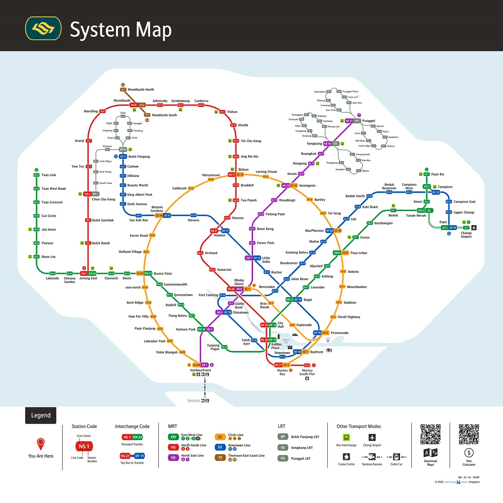

# MRT Exercise

[](https://travis-ci.org/billjh/mrt)
[](https://goreportcard.com/report/github.com/billjh/mrt)


Build a navigator for Singapore MRT network.



This is a web application written in Go providing routing suggestions through HTTP APIs.

## Quick Start

There are a few options to run this web applcation.

### Run with Docker

You can build and run the application in Docker container. Make sure you have Docker installed ([Mac and Windows](https://www.docker.com/products/docker-desktop), [Ubuntu](https://docs.docker.com/engine/install/ubuntu/)).

```
cd mrt
docker build -t mrt .
docker run -it --rm -p 8080:8080 mrt
```

### Run with Docker Compose

You can run the application using docker-compose. For Mac and Windows, docker-compose comes with [Docker Desktop](https://www.docker.com/products/docker-desktop) installation. For Linux distributions like Ubuntu, follow the [Docker Compose documentation](https://docs.docker.com/compose/install/#install-compose-on-linux-systems).

```
cd mrt
docker-compose up
```

### Run with Go

You can run the web server directly with `go run` command if you have Go compiler [installed](https://golang.org/doc/install). Try `brew install go` if you are using Mac.

```
cd mrt
go run .
```

### Interact with API (with cURL)

You can use cURL to send request to the running APIs.

**Navigate API v1** for routing without time consideration:

```shell
curl -i --data '{"source":"Jurong East", "destination":"HarbourFront", "all":false}' http://localhost:8080/api/navigate/v1
```

<details>
<summary>Example response</summary>

```
HTTP/1.1 200 OK
Content-Type: application/json
Date: Sun, 08 Nov 2020 10:42:39 GMT
Content-Length: 612

[{"source":"Jurong East","destination":"HarbourFront","stations_travelled":10,"route":["EW24","EW23","EW22","EW21","EW20","EW19","EW18","EW17","EW16","NE3","NE1"],"instructions":["Take EW line from Jurong East to Clementi","Take EW line from Clementi to Dover","Take EW line from Dover to Buona Vista","Take EW line from Buona Vista to Commonwealth","Take EW line from Commonwealth to Queenstown","Take EW line from Queenstown to Redhill","Take EW line from Redhill to Tiong Bahru","Take EW line from Tiong Bahru to Outram Park","Change from EW line to NE line","Take NE line from Outram Park to HarbourFront"]}]
```
</details>

**Navigate API v2** for routing with time consideration:

```shell
curl -i --data '{"source":"Jurong East", "destination":"HarbourFront", "time":"2020-11-09T18:30", "all":false}' http://localhost:8080/api/navigate/v2
```

<details>
<summary>Example response</summary>

```
HTTP/1.1 200 OK
Content-Type: application/json
Date: Sun, 08 Nov 2020 10:42:53 GMT
Content-Length: 602

[{"source":"Jurong East","destination":"HarbourFront","minutes":107,"route":["EW24","EW23","EW22","EW21","EW20","EW19","EW18","EW17","EW16","NE3","NE1"],"instructions":["Take EW line from Jurong East to Clementi","Take EW line from Clementi to Dover","Take EW line from Dover to Buona Vista","Take EW line from Buona Vista to Commonwealth","Take EW line from Commonwealth to Queenstown","Take EW line from Queenstown to Redhill","Take EW line from Redhill to Tiong Bahru","Take EW line from Tiong Bahru to Outram Park","Change from EW line to NE line","Take NE line from Outram Park to HarbourFront"]}]
```
</details>


### Running Test and Benchmark

Run all the tests and access line coverage with `go test -cover`.

```
➜ go test -cover
PASS
coverage: 76.5% of statements
ok  	github.com/billjh/mrt	0.076s
```

Run the benchmarks with `go test -bench=.`.

```
➜ go test -bench=. -benchmem
goos: darwin
goarch: amd64
pkg: github.com/billjh/mrt
BenchmarkGraphBFS-16                 	   31124	     38314 ns/op	   18532 B/op	      44 allocs/op
BenchmarkGraphDijkstra-16            	   18567	     64374 ns/op	   17399 B/op	      35 allocs/op
BenchmarkGraphDijkstraAll-16         	    6351	    180006 ns/op	   39593 B/op	     121 allocs/op
BenchmarkNavigateByStopsSingle-16    	  315939	      3768 ns/op	    4319 B/op	      56 allocs/op
BenchmarkNavigateByStopsAll-16       	  314380	      3758 ns/op	    4319 B/op	      56 allocs/op
BenchmarkNavigateByTimeSingle-16     	  103298	     11543 ns/op	   37067 B/op	      65 allocs/op
BenchmarkNavigateByTimeAll-16        	  103138	     11575 ns/op	   37067 B/op	      65 allocs/op
PASS
ok  	github.com/billjh/mrt	10.090s
```

## API Design

This application implements two APIs for querying route between two stations.

### GET /api/navigate/v1

The V1 API accepts GET request on /api/navigate/v1, and return one or more route suggestions ordered by **the number of stops**.

The _source_ and _destination_ field can be either a station name (eg. "Orchard"), or a station code (eg. "NS22"). 

If the _all_ flag is set to false, only the shortest route would be returned in the array.

<details>
<summary>Example V1 request body</summary>

```javascript
{
    "source": "Jurong East",
    "destination": "HarbourFront",
    "all": true
}
```
</details>

<details>
<summary>Example V1 response body</summary>

```javascript
[
    {
        "source": "Jurong East",
        "destination": "HarbourFront",
        "stations_travelled": 10,
        "route": [
            "EW24",
            "EW23",
            "EW22",
            "EW21",
            "EW20",
            "EW19",
            "EW18",
            "EW17",
            "EW16",
            "NE3",
            "NE1"
        ],
        "instructions": [
            "Take EW line from Jurong East to Clementi",
            "Take EW line from Clementi to Dover",
            "Take EW line from Dover to Buona Vista",
            "Take EW line from Buona Vista to Commonwealth",
            "Take EW line from Commonwealth to Queenstown",
            "Take EW line from Queenstown to Redhill",
            "Take EW line from Redhill to Tiong Bahru",
            "Take EW line from Tiong Bahru to Outram Park",
            "Change from EW line to NE line",
            "Take NE line from Outram Park to HarbourFront"
        ]
    },
    {
        "source": "Jurong East",
        "destination": "HarbourFront",
        "stations_travelled": 11,
        "route": [
            "EW24",
            "EW23",
            "EW22",
            "EW21",
            "CC22",
            "CC23",
            "CC24",
            "CC25",
            "CC26",
            "CC27",
            "CC28",
            "CC29"
        ],
        "instructions": [
            "Take EW line from Jurong East to Clementi",
            "Take EW line from Clementi to Dover",
            "Take EW line from Dover to Buona Vista",
            "Change from EW line to CC line",
            "Take CC line from Buona Vista to one-north",
            "Take CC line from one-north to Kent Ridge",
            "Take CC line from Kent Ridge to Haw Par Villa",
            "Take CC line from Haw Par Villa to Pasir Panjang",
            "Take CC line from Pasir Panjang to Labrador Park",
            "Take CC line from Labrador Park to Telok Blangah",
            "Take CC line from Telok Blangah to HarbourFront"
        ]
    }
]
```
</details>

#### Response Status Codes

| Status Code     | When                                           |
|-----------------|------------------------------------------------|
| 200 OK          | One or more route found                        |
| 400 Bad Request | Source not found, or destination not found     |
| 404 Not Found   | Route not found between source and destination |

### GET /api/navigate/v2

The V2 API accepts GET request on /api/navigate/v2, and return one or more route suggestions ordered by **the estimated travel time** in minutes.

The _source_ and _destination_ field can be either a station name (eg. "Orchard"), or a station code (eg. "NS22"). 

If the _all_ flag is set to "false", only the fastest route would be returned in the array instead.

The _time_ field should have format of "YYYY-MM-DDThh:mm" (eg. "2006-01-02T15:04").

The time of travel plays several parts in route searching.
- Firstly, depends on day in the week (weekday vs. weekend) and time of the day (peak hours, non-peak hours, night hours), the estimiated travel time would be different. 
- Secondly, some lines are not operating at night, so they would be not considered if travel at night.
- Thirdly, if the date of travel is earlier than stations' opening date, those stations would not be considered available in route searching.

<details>
<summary>Example V2 request body</summary>

```javascript
{
    "source": "Jurong East",
    "destination": "HarbourFront",
    "time": "2020-10-09T18:30",
    "all": true
}
```
</details>

<details>
<summary>Example V2 response body</summary>

```javascript
[
    {
        "source": "Jurong East",
        "destination": "HarbourFront",
        "minutes": 107,
        "route": [
            "EW24",
            "EW23",
            "EW22",
            "EW21",
            "EW20",
            "EW19",
            "EW18",
            "EW17",
            "EW16",
            "NE3",
            "NE1"
        ],
        "instructions": [
            "Take EW line from Jurong East to Clementi",
            "Take EW line from Clementi to Dover",
            "Take EW line from Dover to Buona Vista",
            "Take EW line from Buona Vista to Commonwealth",
            "Take EW line from Commonwealth to Queenstown",
            "Take EW line from Queenstown to Redhill",
            "Take EW line from Redhill to Tiong Bahru",
            "Take EW line from Tiong Bahru to Outram Park",
            "Change from EW line to NE line",
            "Take NE line from Outram Park to HarbourFront"
        ]
    },
    {
        "source": "Jurong East",
        "destination": "HarbourFront",
        "minutes": 115,
        "route": [
            "EW24",
            "EW23",
            "EW22",
            "EW21",
            "CC22",
            "CC23",
            "CC24",
            "CC25",
            "CC26",
            "CC27",
            "CC28",
            "CC29"
        ],
        "instructions": [
            "Take EW line from Jurong East to Clementi",
            "Take EW line from Clementi to Dover",
            "Take EW line from Dover to Buona Vista",
            "Change from EW line to CC line",
            "Take CC line from Buona Vista to one-north",
            "Take CC line from one-north to Kent Ridge",
            "Take CC line from Kent Ridge to Haw Par Villa",
            "Take CC line from Haw Par Villa to Pasir Panjang",
            "Take CC line from Pasir Panjang to Labrador Park",
            "Take CC line from Labrador Park to Telok Blangah",
            "Take CC line from Telok Blangah to HarbourFront"
        ]
    }
]
```
</details>

#### Response Status Codes

| Status Code     | When                                           |
|-----------------|------------------------------------------------|
| 200 OK          | One or more route found                        |
| 400 Bad Request | Source not found, or destination not found     |
| 400 Bad Request | Fail to parse time from string                 |
| 404 Not Found   | Route not found between source and destination |
